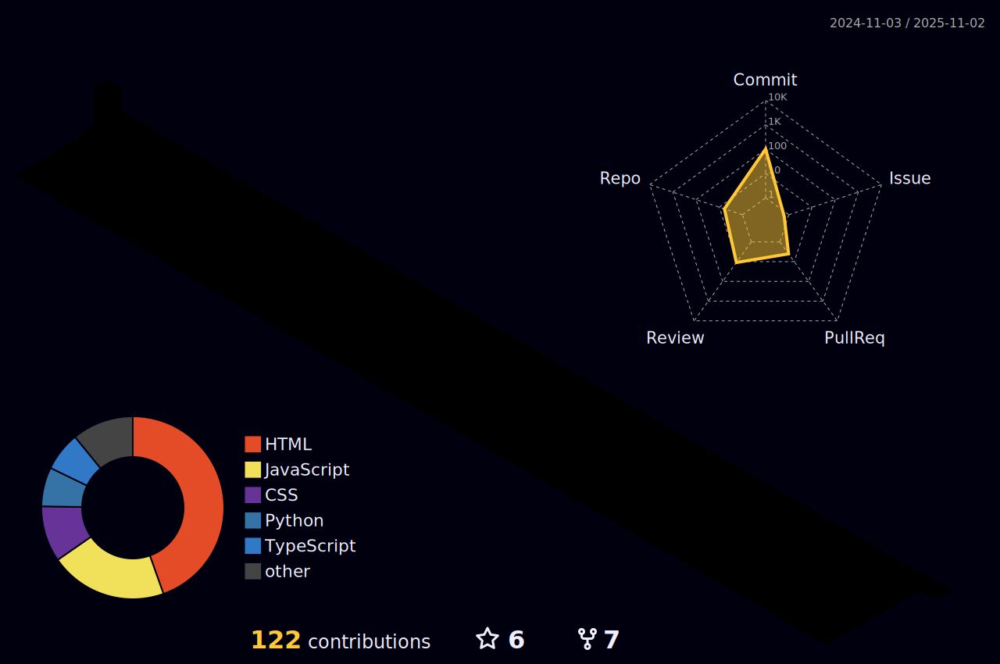

 ### Guten Morgen 👋

<h1 align="center">My Name is Gavin Pereira</h1>

Nice to Meet you.

<h3 align="left">Connect with me:</h3>

### Languages and Tools I Use :
<code></code>
<code></code>
<code></code>
<code></code>
<code></code>
 
<code></code>
<code></code>
<code></code>
<code></code>
<code></code>
 
<code></code>
<code></code>
<code></code>
<code></code>

### Languages Currently that I Know:

